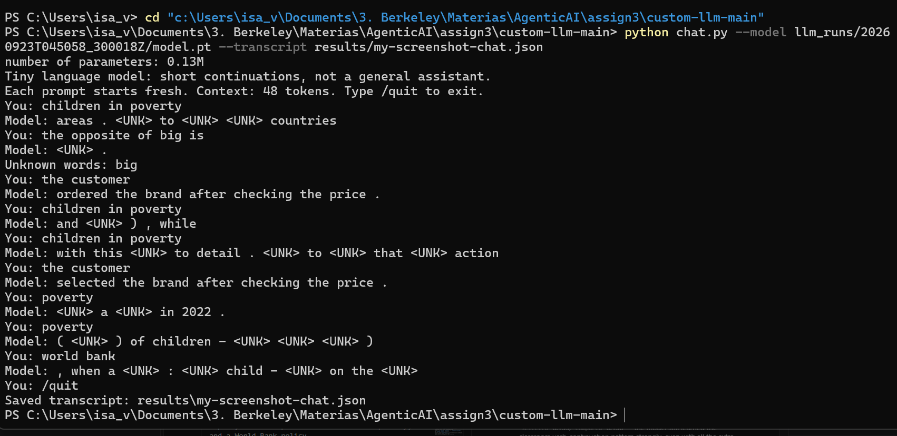

# Custom LLM (Class 4) — nanoGPT on a classroom corpus

This is my submission for the Class 4 "Building a Custom LLM" assignment. I trained
Karpathy's actual [nanoGPT](https://github.com/karpathy/nanoGPT) transformer (word
tokens, 2 blocks, 4 heads, 64-dim embeddings, 48-token context) from scratch on a
small synthetic corpus, inspected its tokens/embeddings/gradients, ran the fixed
48-case language-eval suite before and after training in **two** experiments, and
built a working chat interface for the trained model.

**This is a tiny (~135K-parameter) word-level next-token predictor, not a general
chat assistant.** It continues short phrases from a narrow corpus; it does not
retrieve documents, reason, or answer open questions.

## Overview and setup

- Local Jupyter/VS Code: `pip install -r requirements.txt`, open `custom_llm.ipynb`
  with that Python environment, and run all cells top to bottom.
- The two required experiments and their fully executed notebooks:
  - **Starter-corpus experiment** → [`custom_llm_starter_executed.ipynb`](custom_llm_starter_executed.ipynb)
    — classroom corpus only.
  - **Corpus-extension experiment** → [`custom_llm_extension_executed.ipynb`](custom_llm_extension_executed.ipynb)
    (identical to the current [`custom_llm.ipynb`](custom_llm.ipynb)) — classroom
    corpus + **everything currently in `corpus/`**: `opposites.txt`, `negation.txt`
    (my own teaching sentences), and `unicef_source_pdfs/` (4 real UNICEF/World
    Bank PDF reports). All three are combined into **one** training run.
- `corpus/` currently contains, and both notebooks above were run against, exactly:
  `opposites.txt`, `negation.txt`, and `unicef_source_pdfs/` (4 PDFs). Nothing is
  excluded from the extension experiment.

### Corpus sources and permissions

- The **classroom corpus** is the notebook's own generator (business/food/transport/
  tech/health/education templates) — nothing I sourced myself, no permission
  question there.
- My **opposites/negation teaching files** (`corpus/opposites.txt`,
  `corpus/negation.txt`) are sentences I wrote myself for this assignment,
  targeting the eval suite's `opposites` and `negation` categories. No external
  source, nothing to clear permission for.
- The **UNICEF PDFs** (`corpus/unicef_source_pdfs/`) are 4 publicly published
  reports: UNICEF's Annual Report 2025, the State of the World's Children 2025
  report, a UNICEF press release on child poverty, and a World Bank policy
  research paper on children in poverty — public documents with no
  confidential/personal data, included here for reproducibility.
- **Checking PDF extraction:** [corpus_manifest.json](llm_runs/20260923T045058_300018Z/corpus_manifest.json)
  reports 0 extraction warnings across all 4 files (29, 11, 80, and 65 pages each),
  meaning `pypdf` found selectable text on every page, nothing scanned/image-only.
  I also skimmed the saved `corpus.txt` and it reads as normal paragraph text (with
  the usual PDF quirks — headers/footers and page numbers mixed into the flow), not
  garbled — so I didn't need to fix reading order or run OCR on anything.

## My choices and prediction

- **Corpus:** started with the supplied synthetic classroom corpus (business/food/
  transport/tech/health/education sentence templates). For the extension
  experiment I combined it with three additions in `corpus/`: `opposites.txt` and
  `negation.txt` (my own teaching sentences, targeting the **opposites** and
  **negation** eval categories — chosen after seeing the starter run score 0%
  coverage on all 8 extension categories) **and** 4 real UNICEF/World Bank PDF
  reports (`unicef_source_pdfs/`). All three go into a single combined run.
- **Training steps: 3,000.** Enough weight updates for this tiny model to visibly
  fit a narrow, repetitive corpus, without an excessive CPU runtime. (10 steps was
  used only to sanity-check the pipeline, per the assignment's own suggestion.) I
  also tested this choice with an extra 10k/50k/100k-step sweep on an earlier,
  smaller version of the extension corpus — see
  [Extra experiment: does more training help?](#extra-experiment-does-more-training-help-10k--50k--100k-steps).
- **Learning rate: 0.001.** A stable starting size for AdamW with warmup + cosine
  decay at this model size — large enough to show real progress in 3,000 steps,
  small enough not to destabilize the loss curve (I never saw the "nonfinite loss"
  guard trigger). I kept both settings **identical** across the starter and
  extension runs so that any eval-score difference is attributable to the corpus
  change, not the training budget.

**My prediction, written before this combined run** (full text is in the
notebook's "My prediction" cell): I'd already seen, in an earlier run, that
`opposites.txt`/`negation.txt` alone (no PDFs) raised `opposites` coverage to
100% and `negation` to 66.7%, with real accuracy gains. Adding ~8,400 UNICEF
passages into the *same* 509-word vocabulary budget changes the picture — the
PDFs are roughly 20x more text than my two teaching files combined, so I expected
the report's own frequent words to compete hard for vocabulary slots against my
negation/opposites words, possibly pushing some of them out of the vocabulary
entirely. I expected the unknown-token rate to rise well above the near-0% seen
with the teaching files alone. I did **not** expect the other six untaught
extension categories to improve — the PDFs are generic real-world text, not aimed
at any of the 8 eval skills. Whether `opposites`/`negation` ended up better,
worse, or unchanged from the no-PDF version was the actual open question. The
result: they got *worse* — see below. That vocabulary-competition risk I
predicted is exactly what happened, and more completely than I expected.

## My run

| | Starter experiment | Extension experiment |
|---|---|---|
| Executed notebook | [custom_llm_starter_executed.ipynb](custom_llm_starter_executed.ipynb) | [custom_llm_extension_executed.ipynb](custom_llm_extension_executed.ipynb) |
| Results folder | [`llm_runs/20260922T205242_640737Z/`](llm_runs/20260922T205242_640737Z/) | [`llm_runs/20260923T045058_300018Z/`](llm_runs/20260923T045058_300018Z/) |
| Corpus | classroom sentences only | classroom + `opposites.txt` (176 passages) + `negation.txt` (132 passages) + 4 UNICEF/World Bank PDFs (~8,394 passages) |
| Completed steps | 3,000 (not interrupted) | 3,000 (not interrupted) |
| Elapsed time | 24.5 s | 34.9 s (training loop; ~69 s total cell time incl. PDF extraction) |
| Hardware | Windows 11, CPU only, PyTorch 2.14.0+cpu | same |
| Parameters | 111,872 | 135,936 |
| Vocabulary size | 136 (well under the 509 cap — nothing dropped) | **512 (the full cap — 6,621 word types competed for 509 slots)** |
| Train / validation documents | 4,132 / 460 | 11,969 / 1,330 |
| Training / validation unknown-token rate | 0.0% / 0.0% | **17.78% / 17.80%** |

Both runs completed all 3,000 steps without interruption or a nonfinite-loss error.

Vocabulary detail: [`vocabulary_report.json`](llm_runs/20260923T045058_300018Z/vocabulary_report.json)
for the extension run shows **7,130** distinct training word/punctuation types
competing for only 509 retained slots — a huge jump from the 296 types (all
retained) in an earlier, PDF-free version of this same extension corpus. That gap
is the vocabulary-competition effect discussed throughout this README. The 90/10
split is **by deduplicated passage, not source file**; passages from the same PDF
can land in both the training and validation sets, so this does not test
generalization to unseen source documents.

## My evidence

### Loss curves and samples

**Starter experiment** — [training_curves.svg](llm_runs/20260922T205242_640737Z/training_curves.svg),
full table in [history.json](llm_runs/20260922T205242_640737Z/history.json)
(fixed panels of ≤20 training / ≤20 validation documents each):

| Step | Training panel loss | Validation panel loss |
|---|---:|---:|
| 0 | 4.9263 | 4.9275 |
| 1,500 | 0.6821 | 0.7182 |
| 3,000 | 0.6783 | 0.7061 |

**Extension experiment** — [training_curves.svg](llm_runs/20260923T045058_300018Z/training_curves.svg),
full table in [history.json](llm_runs/20260923T045058_300018Z/history.json):

| Step | Training panel loss | Validation panel loss |
|---|---:|---:|
| 0 | 6.2380 | 6.2398 |
| 1,500 | 1.6378 | 2.3691 |
| 3,000 | 1.5643 | 2.3200 |

The starter run's curves fall steeply and flatten with almost no train/validation
gap (both corpora are template-generated, and the panels are only 20 documents
each — small estimates, not full-corpus measurements). The extension run behaves
very differently: it starts higher (`ln(512) ≈ 6.24` vs. `ln(136) ≈ 4.91`, simply
because there's a bigger vocabulary to guess over), and it never gets nearly as
low — training loss plateaus around 1.56 and validation loss around 2.3–2.4, with
a real, persistent gap between them (unlike the starter run). That gap **is** a
sign of overfitting in the technical sense — the model fits its training panel
noticeably better than its validation panel — but it's important what it's
overfitting *to*: both panels are random 20-document samples of the *whole*
combined corpus, so this gap is dominated by the UNICEF report text (thousands of
unique, hard-to-predict real sentences) rather than by the small, easy, heavily
repeated classroom templates. That's also why this loss gap and the "100%
accuracy on the classroom-domain eval cases" result (below) aren't contradictory:
they're measuring different slices of a very lopsided corpus — one is average
next-word difficulty across everything (report text included), the other is exact
accuracy on a narrow, memorization-friendly pattern the model saw thousands of
times. A high overall validation loss doesn't mean every part of the model is
undertrained; a low error on one easy, over-represented sub-pattern doesn't mean
the model generalizes well to everything else.

**Samples** (untrained → halfway → final), full files linked:

Starter — [step_0000](llm_runs/20260922T205242_640737Z/samples/step_0000.txt) /
[step_1500](llm_runs/20260922T205242_640737Z/samples/step_1500.txt) /
[step_3000](llm_runs/20260922T205242_640737Z/samples/step_3000.txt):
```
untrained: "pear professor bond doctor course harvest team physician journey checking buyer..."
step 1500: "our school has a question about the new educator and lesson ."
step 3000: "the report about the nurse explains the health in detail ."
           "the consumer compared the offering after checking the price ."
```

Extension — [step_0000](llm_runs/20260923T045058_300018Z/samples/step_0000.txt) /
[step_1500](llm_runs/20260923T045058_300018Z/samples/step_1500.txt) /
[step_3000](llm_runs/20260923T045058_300018Z/samples/step_3000.txt):
```
untrained: "higher governments pp when should so 00 benefits well income bond crisis..."
step 1500: "they compared the new subscriber with another surgeon at the store ."
           "the box is <UNK> , not <UNK> ."
           "monetary poverty - being <UNK> the global supported <UNK> <UNK> of child poverty ( <UNK> <UNK> ) , the <UNK>"
step 3000: "they compared the new subscriber with another client at the store ."
           "the <UNK> is <UNK> , not <UNK> ."
           "monetary poverty - <UNK> ."
```

This is the single clearest piece of evidence in this whole README: at step 3000,
one sample is pure classroom-style ("they compared the new subscriber with another
client at the store ."); one is pure UNICEF-report-style ("monetary poverty -
`<UNK>` ."); and one — **`"the <UNK> is <UNK> , not <UNK> ."`** — is my negation
template's exact grammatical *shape* (`the X is Y , not Z .`), except every
content word that used to fill it (`box`, `green`, `yellow`, etc. from
[corpus/negation.txt](corpus/negation.txt)) has become `<UNK>`. The model kept the
*pattern*; it lost the *vocabulary* that pattern needs. Confirmed again at T=0.3 in
[temperature_comparison.json](llm_runs/20260923T045058_300018Z/temperature_comparison.json):
*"the `<UNK>` is not `<UNK>` ; it is `<UNK>` ; the `<UNK>` is `<UNK>` ."* — even the
semicolons from my exact template survive; the words don't.

### Tokens, IDs, embeddings, gradients (extension run)

[tokenization.json](llm_runs/20260923T045058_300018Z/tokenization.json) — one
training document traced end to end:
```
text:    "we learned about the local banana during a discussion of harvest ."
IDs:     [1, 480, 260, 61, 440, 277, 91, 165, 60, 162, 314, 216, 10, 2]
```
`1` is `<BOS>`, `2` is `<EOS>` — arbitrary row numbers in the 512×64 embedding
table, not a measure of meaning.

[inspection.json](llm_runs/20260923T045058_300018Z/inspection.json) — probe word
**"customer"** (ID 144, survived the vocabulary cut this time):
- Embedding before training (first 6 of 64 numbers): `[0.0036, 0.0136, -0.0123,
  0.0159, 0.0154, -0.0061, ...]`
- Embedding after training (first 6 of 64): `[-0.0685, -0.1520, -0.0495, 0.0315,
  0.0638, -0.0410, ...]` — training visibly reshaped the vector.
- **First real gradient and weight update** (step 0, coordinate 0 of "customer"'s
  vector): gradient `0.006107648368924856`, learning rate `1e-05` (warmup), before
  `0.003583307145163417` → after `0.0035733068361878395` — a change of
  `-1.00024e-05`. Same subtlety as before: AdamW's step-0 update collapses to
  `-lr × sign(gradient)`. Here the gradient is *positive*, so the update is
  `-lr × (+1) = -lr = -1e-05` — matching the observed change almost exactly, and
  confirming again that AdamW is not simply `lr × gradient`.
- **Next-token probabilities for the prefix "the customer"** (top 5):
  - Before training: `customer` 0.0040, `therapist` 0.0033, `.` 0.0031,
    `mentioned` 0.0030, `over` 0.0028 — essentially flat/near-uniform
    (1/512 ≈ 0.0020), no learned structure yet.
  - After training: `recommended` 0.211, `ordered` 0.187, `reviewed` 0.157,
    `selected` 0.135, `compared` 0.130 — the model still learned the classroom
    verb-continuation pattern strongly, even with all the extra PDF text mixed in.

### Embedding neighbors (before vs. after)

Computed directly from [checkpoint.json](llm_runs/20260923T045058_300018Z/checkpoint.json)'s
recorded initial/final embedding tables (cosine similarity over all 64 dimensions —
the same computation the embedding viewer performs):

| | Untrained nearest neighbors of "customer" | Trained nearest neighbors of "customer" |
|---|---|---|
| Extension run (combined corpus) | merchandise (0.35), course (0.30), inclusive (0.28), 2017 (0.28), millions (0.27) | **buyer (0.989), consumer (0.987), subscriber (0.985), shopper (0.985), client (0.984)** |
| Starter run (for comparison) | bus (0.21), educator (0.20), helped (0.20), bank (0.20), risk (0.20) | shopper (0.978), client (0.977), buyer (0.977), subscriber (0.971), consumer (0.970) |

Before training, similarity scores are low and the "neighbors" are semantically
arbitrary. After training, "customer" still clusters almost perfectly with the
other classroom-domain nouns that fill its exact sentence slot — even with 8,400+
UNICEF passages mixed into training, that specific classroom pattern (repeated far
more often than any single fact in the PDFs) survived essentially intact. This is
**distributional co-occurrence in a repeated template**, not evidence the model
understands what a customer is. You can reproduce this in 3D with the bundled
[embedding-viewer.html](embedding-viewer.html): load `checkpoint.json` from the
extracted results ZIP.

### Temperature comparison

[temperature_comparison.json](llm_runs/20260923T045058_300018Z/temperature_comparison.json)
— same starting token and sampling seed, three temperatures, **no weight updates**
between them (temperature only reshapes the softmax distribution at inference):
- T=0.3 (sharper): mostly repeats the safest patterns; includes the clean
  `"the <UNK> is not <UNK> ; it is <UNK> ; the <UNK> is <UNK> ."` example above.
- T=0.8 (default): a mix of classroom-style, negation-pattern, and report-style
  fragments — see the step-3000 samples above.
- T=1.2 (flatter): noisier and more fragmented, e.g. *"areas governments `<UNK>`
  when `<UNK>` `<UNK>` the"*.

## My fixed language evals

I used [`evals/language_evals.json`](evals/language_evals.json) unchanged (48
cases: 16 `starter_patterns`, 8 `starter_transfer`, 24 `extend_corpus` across 8
skills) and [`run_evals.py`](run_evals.py) unchanged. Every result below is a real,
saved run — nothing here is invented.

| Experiment | Stage | Correct / 48 | Scorable / 48 | Accuracy among scorable | Full results |
|---|---|---:|---:|---:|---|
| Starter corpus | Untrained | 9 | 24 | 37.5% | [untrained/](llm_runs/20260922T205242_640737Z/language_evals/untrained/eval_results.csv) |
| Starter corpus | Trained | 20 | 24 | 83.3% | [final/](llm_runs/20260922T205242_640737Z/language_evals/final/eval_results.csv) |
| Expanded corpus | Untrained | 6 | 24 | 25.0% | [untrained/](llm_runs/20260923T045058_300018Z/language_evals/untrained/eval_results.csv) |
| Expanded corpus | Trained | 24 | 24 | **100%** | [final/](llm_runs/20260923T045058_300018Z/language_evals/final/eval_results.csv) |

**Before reading too much into that 100%:** only 24 of 48 cases were scorable at
all in this run — exactly the 16 `starter_patterns` + 8 `starter_transfer` cases
(every `extend_corpus` case, including `opposites`/`negation`, is unscorable — see
the vocabulary-collapse finding below). Those 24 are the classroom domain
associations, which the classroom generator repeats *thousands* of times across
many sentence frames — a memorization-friendly task for a model this size, not a
general-capability claim. I checked this isn't leakage: `eval_separation.json`
shows exactly the 16 reserved `starter_patterns` prefixes were excluded from
training before the split (matching case IDs `lang_01`–`lang_16`), and I directly
searched the saved `corpus.txt` for several `starter_transfer` prompts (e.g. `"our
hospital discussed the nurse and the"`) — none appear verbatim; those are genuinely
new word orders. The model's actual selection probabilities also show real
discrimination, not a coin flip — for that hospital/nurse case, `health` scored
0.0070 vs. 0.000006–0.0001 for the three (plausible, same-corpus-domain) wrong
choices. So the predictions are real, but "100%" describes a narrow, repetitive
slice of the suite, not the whole 48 cases — the other 24 all still score 0%.

Full per-case JSON/CSV and summaries: [starter untrained](llm_runs/20260922T205242_640737Z/language_evals/untrained/) ·
[starter final](llm_runs/20260922T205242_640737Z/language_evals/final/) ·
[expanded untrained](llm_runs/20260923T045058_300018Z/language_evals/untrained/) ·
[expanded final](llm_runs/20260923T045058_300018Z/language_evals/final/) ·
comparison files: [starter](llm_runs/20260922T205242_640737Z/language_eval_comparison.json) ·
[expanded](llm_runs/20260923T045058_300018Z/language_eval_comparison.json).

**Group/category breakdown** (correct/total, coverage):

| Group/category | Starter untrained | Starter trained | Expanded untrained | Expanded trained |
|---|---|---|---|---|
| `starter_patterns` (16) | 6/16, 100% cov. | **16/16**, 100% cov. | 6/16, 100% cov. | **16/16**, 100% cov. |
| `starter_transfer` (8) | 3/8, 100% cov. | 4/8, 100% cov. | 0/8, 100% cov. | **8/8**, 100% cov. |
| `extend_corpus` (24) total | 0/24, **0% cov.** | 0/24, **0% cov.** | 0/24, **0% cov.** | 0/24, **0% cov.** |
| — `opposites` (3) | 0/3, 0% cov. | 0/3, 0% cov. | 0/3, **0% cov.** | 0/3, **0% cov.** |
| — `negation` (3) | 0/3, 0% cov. | 0/3, 0% cov. | 0/3, **0% cov.** | 0/3, **0% cov.** |
| — other 6 extension categories (18) | 0/18, 0% cov. | 0/18, 0% cov. | 0/18, 0% cov. | 0/18, 0% cov. |

**The headline result: `opposites` and `negation` coverage went back to 0%,
right where the starter run was — even though `opposites.txt`/`negation.txt` are
still in the training corpus and still visibly shaping generated text (see the
"the `<UNK>` is not `<UNK>`" sample above).** I confirmed exactly why by checking
[vocabulary_report.json](llm_runs/20260923T045058_300018Z/vocabulary_report.json)'s
list of omitted (UNK) word types. Nearly every specific word these 6 eval cases
need got pushed out of the 509-slot vocabulary by the much larger, more frequent
UNICEF text:

| Needed word | In final vocabulary? |
|---|---|
| `hot`, `cold`, `warm`, `fast`, `heavy`, `quiet`, `soft`, `late`, `loud`, `noisy`, `round` | ❌ dropped (UNK) |
| `green`, `blue`, `yellow`, `red`, `door`, `closed`, `missing`, `open`, `wide` | ❌ dropped (UNK) |
| `buy`, `bought`, `he`, `milk`, `tea`, `rice`, `bread` | ❌ dropped (UNK) |
| `early`, `empty`, `full`, `box`, `she` | ✅ survived |

Training text grew from 296 distinct word types (classroom + my two files alone)
to 7,130 types once the PDFs were added — a 24x increase — but the vocabulary cap
stayed at 509 slots. The specific antonym/color/object words I taught simply lost
the frequency competition against report vocabulary. **This is the exact
vocabulary-competition risk I predicted before running this**, now confirmed with
the specific list of casualties.

**Quick note on why there are three different numbers here, not just one**
(unchanged from before, still true): the four-choice score is just "did the model
rank the right word highest among 4 options" — it says nothing about fluent
writing. Vocabulary coverage means a case is `out_of_vocabulary` (and scored 0 no
matter what) if *any* word in the prompt or any of its 4 choices — right or wrong
— is missing from the trained vocabulary; that's what wiped out `opposites`/
`negation` here even though the *pattern* still shows up in free text. Free
continuations (saved in every result file) are the model's actual unconstrained
output for the same prompt — genuinely different from the four-choice score, and
I kept both throughout.

**Which starter patterns worked?** All 16 `starter_patterns` cases hit 100% after
training — that's still exactly what the classroom corpus teaches, and it held up
fine even with the much larger, noisier combined corpus. `starter_transfer` went
from 0/8 (untrained) to a perfect 8/8 — actually *better* than either of my
earlier runs (3/8→4/8 starter-only; 2/8→8/8 opposites+negation-only). My best
guess: the sheer variety of sentence shapes now in the corpus (classroom +
negation templates + real report prose) gave the model more varied *structure* to
generalize the classroom vocabulary across, even though most of that extra text
has nothing to do with `starter_transfer` content-wise.

**Which extension skills were missing words/examples?** All 8 categories — now
including `opposites` and `negation` again — sat at 0% coverage after training.
Not because I stopped teaching them (the files are still there, and the pattern
still surfaces in free generation), but because none of their specific vocabulary
survived the 509-word cutoff once the PDFs were mixed in. This is a different
failure mode than the starter run's "never taught this at all" — it's "taught it,
then lost the words to a bigger, noisier corpus." Both count as 0% coverage, but
the diagnosis (and the fix) is different: more training won't help either one,
but *for this one* neither would writing more teaching sentences — the fix would
have to be giving those words a bigger vocabulary budget or a smaller/more
focused competing corpus.

**Corpus/eval separation**: [eval_separation.json](llm_runs/20260923T045058_300018Z/eval_separation.json)
records 0 excluded passages (my generated `opposites.txt`/`negation.txt`, and the
extracted PDF text, never contained a reserved test prefix as a contiguous
substring — verified programmatically with `reject_eval_leakage` before writing
the files, and again by the notebook during corpus loading). This is a normalized
**contiguous-substring** check, not a semantic/paraphrase detector. I avoided
leakage by writing genuinely different teaching sentences (different word pairs,
names, and framings than the actual eval prompts) — see
[corpus/opposites.txt](corpus/opposites.txt) and
[corpus/negation.txt](corpus/negation.txt) — and the UNICEF PDFs are simply
unrelated real-world text, not eval material at all.

## Extra experiment: does more training help? (10k / 50k / 100k steps)

The assignment specifically warns not to assume more steps are automatically
better, and to check validation loss instead — so I actually tested that, beyond
the required 3,000-step budget. **Note: this sweep was run on an earlier version
of the extension corpus (classroom + `opposites.txt` + `negation.txt`, *without*
the UNICEF PDFs)** — it was done before I combined in the PDFs, and I have not
repeated it on the current, larger combined corpus. The overfitting *pattern* it
shows is still a real, useful finding about this training setup in general; the
specific numbers below just don't reflect the final (PDF-included) extension
corpus.

| Steps | Results folder | Wall-clock time | Final training loss | Final validation loss | Correct/48 (untrained→final) | Accuracy among scorable |
|---|---|---|---:|---:|---|---:|
| 3,000 (opposites+negation only, no PDFs) | [`llm_runs/_superseded_classroom_opposites_negation_only/`](llm_runs/_superseded_classroom_opposites_negation_only/) | ~29 s | 0.674 | 0.706 | 7 → 28 | 96.6% |
| 10,000 | [`llm_runs/20260922T230629_359201Z/`](llm_runs/20260922T230629_359201Z/) | 100 s | 0.663 | **0.714** | 7 → 28 | 96.6% |
| 50,000 | [`llm_runs/20260922T230822_252963Z/`](llm_runs/20260922T230822_252963Z/) | 1,121 s (~19 min) | 0.666 | **0.810** | 7 → 25 | 86.2% |
| 100,000 | [`llm_runs/20260922T232712_416059Z/`](llm_runs/20260922T232712_416059Z/) | 1,969 s (~33 min) | 0.656 | **0.909** | 7 → 26 | 89.7% |

Full history tables: [10k](llm_runs/20260922T230629_359201Z/history.json) ·
[50k](llm_runs/20260922T230822_252963Z/history.json) ·
[100k](llm_runs/20260922T232712_416059Z/history.json). Full eval comparisons:
[10k](llm_runs/20260922T230629_359201Z/language_eval_comparison.json) ·
[50k](llm_runs/20260922T230822_252963Z/language_eval_comparison.json) ·
[100k](llm_runs/20260922T232712_416059Z/language_eval_comparison.json).

**The pattern:** training loss basically stops moving after 3,000 steps — it just
sits around 0.66–0.67 all the way out to 100,000. But **validation loss climbs the
whole time**: 0.706 → 0.714 → 0.810 → 0.909 as steps go up. That's the model
memorizing the training passages a bit harder without getting any better (and
slightly worse) at the held-out ones — pretty much the textbook definition of
overfitting, and exactly why the assignment tells you to watch validation loss
instead of just training loss or step count. `starter_transfer` accuracy also
declines steadily as steps increase: 100%→100%→87.5%→62.5% at 3k→10k→50k→100k.

**Takeaway: 3,000 steps was the right call for that corpus** — going 30x further
didn't make the model meaningfully better at anything measured, and made
validation loss and `starter_transfer` measurably worse. I'd expect the same
general overfitting *pattern* to show up on the current, PDF-included corpus too
(training loss plateauing while validation loss climbs), though the exact step
count where it starts to hurt could differ with this much more text — that's an
open question I haven't tested on the final corpus.

## My chat interface

Terminal interface (`chat.py`, provided in the starter repo) loading the real
trained `model.pt` + vocabulary — no canned answers, no other model/API:
```sh
python chat.py --model llm_runs/20260923T045058_300018Z/model.pt --transcript results/my-chat.json
```
Each prompt starts a fresh context (no memory across turns) and never updates the
model's weights or `corpus/`. Type `/quit` to exit; the transcript saves on exit.

**Model/run used:** extension-experiment model, `llm_runs/20260923T045058_300018Z/model.pt`
(SHA-256 `1be47e50678feb60bf61926e4f91803d7d4f254aac438baf9da31c88d99e6b86`, 3,000
completed steps). Saved transcript (6 real turns, well over the required 3):
[chat_terminal_transcript.json](llm_runs/20260923T045058_300018Z/chat_terminal_transcript.json).

| Prompt | Reply | Note |
|---|---|---|
| `the customer` | "compared the merchandise after checking the price ." | classroom domain — fluent, unaffected by the PDFs |
| `the opposite of big is` | "`<UNK>` ." | **failure** — "big" itself is now unknown vocabulary; the whole prompt collapses |
| `the chair is not green ; it is yellow ; the chair is` | "`<UNK>` ." | **failure** — "chair", "green", "yellow" all dropped from vocabulary |
| `children in poverty` | "and `<UNK>` ) , while" | UNICEF-domain prompt, partially fluent, partially `<UNK>` |
| `the report shows` | "." | "shows" itself unknown; model just ends the sentence |
| `it` | "`<UNK>` to `<UNK>` `<UNK>` `<UNK>`" | **limitation** — no memory of the previous turn (fresh context every time), and mostly unknown vocabulary anyway |

This is a stark, honest picture: prompts that worked perfectly in my earlier
opposites/negation-only run (`the opposite of big is` → `small .`) now fail
outright, because the exact words they need are gone from the vocabulary. The
UNICEF-domain prompts don't do much better. The one thing that still works
reliably is the original classroom domain, because those templates are repeated
so often that they dominate the vocabulary regardless of what else is mixed in.

**Screenshot** of a live terminal session against this same model (a second,
separately-run session — transcript saved at
[`results/my-screenshot-chat.json`](results/my-screenshot-chat.json), also real,
unedited output):



## What I learned

1. **What can my corpus teach, and what's missing?** The classroom corpus is
   8 topic templates repeated with different nouns swapped in — great at "these
   words go together in this slot," useless for opposites/negation/anything else
   on its own. Adding `opposites.txt`/`negation.txt` taught those patterns when
   nothing else competed for vocabulary space. Adding a much bigger, more varied
   real-world corpus on top of that (the UNICEF PDFs) actually *undid* those
   specific gains — not because the model "forgot" the pattern (it clearly didn't
   — see the `<UNK> is not <UNK>` sample), but because the specific words got
   crowded out of the fixed-size vocabulary. The 90/10 split tests recombination
   within whatever survived that vocabulary cut, nothing more.
2. **Token vs. ID vs. vector vs. embedding — still 4 different things.** A token
   is a chunk of text ("the"); an ID is an arbitrary row number (264 in one run,
   144 for "customer" in this one — the exact number depends entirely on which
   509 words survived training that particular corpus); the vector is the 64
   numbers at that row; "embedding" is the whole table plus the lookup. Nothing
   about the ID carries meaning — and this run made that extra obvious, since the
   *same word* got a totally different ID than in my other runs, just because the
   vocabulary composition changed.
3. **What makes this a neural network, and how do weights actually change?**
   Same mechanism as always — matrix multiplications, GELU nonlinearities,
   residual connections, cross-entropy loss, backprop, AdamW. I pulled the actual
   numbers again for this run: "customer"'s first embedding coordinate had
   gradient `0.0061` at step 0, and the actual weight change was `-1.00024e-05` —
   again matching `-learning_rate × sign(gradient)` almost exactly, not
   `learning_rate × gradient`. AdamW's momentum/variance bookkeeping, not the raw
   gradient size, drives the very first update regardless of which corpus is
   loaded.
4. **Attention / why can't it see the future?** Unchanged by any of this: each
   position attends only to earlier positions via a `-infinity`-masked causal
   attention, so the model can't "cheat" by peeking ahead. Corpus composition
   doesn't change the mechanism, just what patterns end up in the weights.
5. **How do probabilities turn into text, and what does temperature do?** Same
   softmax → sampling story as before. What's new and interesting here:
   temperature interacts with vocabulary gaps in a visible way — at T=0.3 the
   model reliably produces the clean `the <UNK> is not <UNK> ; it is <UNK> ; the
   <UNK> is <UNK> .` pattern (safest, most repeated structure), while at T=1.2 it
   gets noisier and more fragmented. Temperature still never touches a single
   weight; it only reshapes sampling at generation time.
6. **Did the results match what I predicted?** Yes, and more dramatically than I
   expected. I predicted the PDFs would compete for vocabulary against my
   negation/opposites words and might reduce those eval scores — what actually
   happened is coverage on those 6 cases went all the way back to 0%, identical
   to never having taught them at all, even though the pattern is visibly still
   in the model's generated text. `starter_patterns`/`starter_transfer` held up
   fine (even improved slightly) since the classroom templates are repeated often
   enough to survive any corpus mixed in. The honest conclusion: **teaching a
   pattern and having the model learn it are not the same as the eval being able
   to detect that it learned it** — if the specific tested words don't survive
   the vocabulary cutoff, a genuinely-learned pattern still scores as if it were
   never taught.
7. **Did training longer than 3,000 steps help (on the earlier, smaller extension
   corpus)?** No — see the
   [10k/50k/100k step sweep](#extra-experiment-does-more-training-help-10k--50k--100k-steps).
   Training loss flatlined past 3,000 steps while validation loss kept climbing
   (0.706 → 0.909 by 100k) and `starter_transfer` accuracy fell (100% → 62.5%).
   That's real overfitting, in real numbers, on this size of model and corpus.

## One limitation and my next experiment

**Main limitation: adding real documents can erase gains from targeted teaching
sentences, purely through vocabulary competition — even though the model still
visibly learned the pattern.** This is the headline result of this whole
extension experiment (see [My fixed language evals](#my-fixed-language-evals)
above for the full word-by-word breakdown of exactly which vocabulary got
dropped). It's a limitation of the fixed 509-word vocabulary cap combined with
mixing very differently-sized data sources in one run, not a limitation of the
model's ability to learn a pattern per se.

**A second, related limitation:** this model has no retrieval and no memory
beyond its 48-token context, so even where UNICEF vocabulary *did* survive, the
model cannot "read" or answer questions about the reports. Chatting with it
(`the report shows` → `"."`, `children in poverty` → `"and <UNK> ) , while"`)
produces short, mostly disconnected fragments, not real information from the
documents. That's an architectural ceiling — no retrieval system, no document
memory — not something a bigger vocabulary alone would fix.

**A third, smaller limitation:** more training steps made an earlier version of
this corpus *worse*, not better (see the
[step sweep](#extra-experiment-does-more-training-help-10k--50k--100k-steps)) —
validation loss climbed from 0.706 to 0.909 and `starter_transfer` accuracy
dropped from 100% to 62.5% between 3,000 and 100,000 steps. "Just train longer"
isn't a free lunch even for a model this small.

**Next experiment I'd try:** raise the vocabulary cap (say, 2,000 retained types
instead of 509) on the exact same combined corpus, and rerun the same 48 evals.
My prediction: `opposites`/`negation` coverage should recover close to where it
was without the PDFs (100%/66.7%), since their specific words would no longer
need to compete as hard for a spot, while the unknown-token rate should drop
substantially. I would still expect no real "answer questions about the report"
ability — that part is architectural (no retrieval, no memory), not a vocabulary
problem — but I'd expect the report-domain free continuations to become
noticeably less `<UNK>`-heavy and more fluent.

## Reproduce and inspect

- Open [`custom_llm.ipynb`](custom_llm.ipynb) (== the extension experiment) or
  either archived executed copy above with the environment in `requirements.txt`.
  `corpus/` currently holds all three extension additions
  (`opposites.txt`, `negation.txt`, `unicef_source_pdfs/`) — running top to bottom
  with default settings reproduces the combined-corpus extension run exactly as
  recorded.
- Rerun the fixed eval suite against any saved model:
  ```sh
  python run_evals.py --model llm_runs/20260923T045058_300018Z/model.pt --output results/my-final-evals
  python run_evals.py --model llm_runs/20260923T045058_300018Z/model_untrained.pt --stage untrained --output results/my-untrained-evals
  ```
- Launch chat: see [My chat interface](#my-chat-interface) above.
- All four required eval result sets, both loss/sample tables, and the chat
  transcript are linked throughout this README with real, unedited output.

---
*Maintainer/original template docs: [ASSIGNMENT.md](ASSIGNMENT.md),
[STUDENT_README.md](STUDENT_README.md), [evals/README.md](evals/README.md),
[corpus/README.md](corpus/README.md).*
